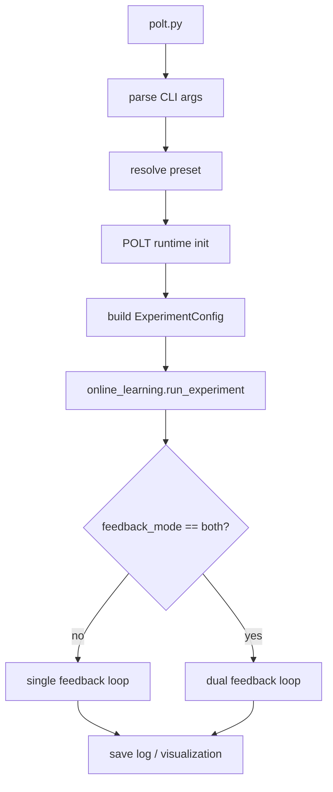
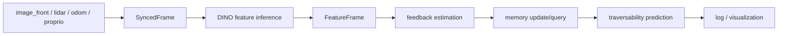

# POLT Developer Guide

## 1. 文档定位

本文档面向需要阅读、修改和扩展 POLT 代码的开发者。README 负责说明项目是什么、如何安装、如何运行；本文档重点解释：

- POLT 代码如何组织；
- 主程序如何从命令行进入实验流程；
- 数据、配置和运行状态如何在模块间流动；
- 修改功能时应优先查看哪些文件。

本文档以当前仓库代码为准。若后续修改 `polt.py`、`config.py` 或主流程模块，应同步更新本文档。


## 2. 总体架构

当前仓库的主体结构如下：

```text
POLT/
├── polt.py
├── config.py
├── sensors/
├── polt_runtime/
├── model/
├── planning/
└── utils/
```

各部分职责：

- `polt.py`：命令行入口，解析参数并调用 `POLT.run_experiment(...)`。
- `config.py`：实验配置、默认路径、preset 和配置轴管理。
- `sensors/`：传感器数据读取与预处理，包括 LiDAR、图像和本体感受。
- `polt_runtime/`：主运行流程、感知、投影、feedback 估计、记忆机制、日志和可视化。
- `model/`：模型组件，当前分为 `vision/`、`proprio/`、`memory/` 和 `third_party/`。
- `planning/`：规划相关扩展模块；当前主实验流程可以通过 `--disable-planner` 关闭规划分支。
- `utils/`：离线工具脚本，包括 DINO 特征导出、手动特征节点导出和 VLAD 训练；不属于主 runtime frame loop。

`model/` 当前结构：

```text
model/
├── vision/
│   ├── dinov3_infer.py
│   ├── vlad.py
│   └── vlad_cache/
├── proprio/
│   ├── TemporalPINNs_Dugoff.py
│   └── salon_cost.py
├── memory/
│   ├── GPRMemoryForest.py
│   └── DataBuffer_Cost_GPR.py
└── third_party/
    └── dinov3/
```

说明：

- `model/vision/` 提供图像特征提取和 VLAD 特征压缩；
- `model/proprio/` 提供力学 feedback 模型和 roughness/SALON cost 计算；
- `model/memory/` 提供 `dynamic_memory` 和 `max_similiarity_out` 对应的 GPR memory 实现；
- `model/third_party/` 只放第三方源码，不直接承载 POLT 自己的业务逻辑；
- 旧 DINO project 的历史输出已移到 `outputs/legacy_dino_project/`。

核心运行对象是 `polt_runtime/runtime/coordinator.py` 中的 `POLT` 类。它保存运行时状态，例如数据文件索引、时间戳列表、缓存点云、日志、可视化状态和 planner 状态。


## 3. 主运行流程

典型运行命令：

```bash
python polt.py --root /path/to/dataset --preset online_learning
```

控制流如下：

```text
python polt.py --root /path/to/dataset --preset online_learning
        |
        v
polt.py 解析命令行参数
        |
        v
根据 --mode / --preset 选择实验 preset
        |
        v
初始化 POLT runtime
        |
        v
POLT.build_experiment_config(...) 生成 ExperimentConfig
        |
        v
POLT.run_experiment(...)
        |
        v
polt_runtime/online_learning.py::run_experiment(...)
        |
        v
进入单反馈或双反馈主实验流程
        |
        v
逐帧同步、投影、估计反馈、更新 memory、预测 cost
        |
        v
保存日志、可选可视化、可选规划输出
```

代码入口关系：

- `polt.py`
  - `build_parser()`
  - `_resolve_preset(mode, preset)`
  - `main()`
- `polt_runtime/runtime/coordinator.py`
  - `POLT.__init__()`
  - `POLT.build_experiment_config(...)`
  - `POLT.run_experiment(...)`
- `polt_runtime/online_learning.py`
  - `run_experiment(...)`
  - `_run_single_feedback_experiment(...)`
  - `_run_dual_feedback_experiment(...)`

当前 `POLT.__init__()` 中默认使用 `torch.device("cuda")`。如果需要 CPU 或其他设备支持，应从 `coordinator.py` 开始修改，并检查所有直接调用 CUDA 同步的模块。


## 4. 配置系统

配置集中在 `config.py`。

### 4.1 ExperimentConfig

`ExperimentConfig` 是主实验配置对象。它包含：

- 实验名：`name`
- feedback 类型：`feedback_mode`
- memory 类型：`memory_mode`
- 更新方式：`update_mode`
- 模型与 memory 路径
- VLAD 相关参数
- 可视化开关
- planner 开关
- 日志文件名
- profiling 与 trace 保存选项

`POLT.build_experiment_config(...)` 会将命令行参数转换为 `ExperimentConfig` override，再调用 `get_experiment_config(...)` 生成最终配置。

### 4.2 命令行参数

`polt.py` 中主要参数包括：

- `--root`：数据集根目录。当前代码中存在开发阶段的默认本地路径，实际使用建议显式传入。
- `--mode`：可选运行模式。若为 `experiment`，则使用 `--preset`。
- `--preset`：选择 `config.py` 中定义的实验 preset。
- `--feedback-mode`：覆盖 feedback 类型。
- `--memory-mode`：覆盖 memory 类型。
- `--update-mode`：覆盖在线/离线更新方式。
- `--proprio-checkpoint`：本体感受模型权重路径。
- `--mem-buffer`：单反馈 memory buffer 路径。
- `--mechanical-mem-buffer`：力学分支 memory buffer 路径。
- `--roughness-mem-buffer`：粗糙度分支 memory buffer 路径。
- `--disable-vlad`：关闭 VLAD 特征压缩。
- `--disable-planner`：关闭 planner 分支。
- `--max-frames`：限制处理帧数。

注意：当前 `--vis` 在 `polt.py` 中定义为 `parser.add_argument("--vis", default=True)`，这不是标准布尔开关写法。默认值为 `True`，如果要调整可视化行为，建议后续改为 `action="store_true"` / `action="store_false"` 的显式形式。

### 4.3 三个主要配置轴

```text
feedback_mode: mechanical / roughness / both
memory_mode: dynamic_memory / max_similiarity_out
update_mode: online / offline
```

说明：

- `mechanical` 在文档中通常译为“力学反馈”。
- `max_similiarity_out` 是当前代码中的实际拼写，请不要在文档或配置中擅自改为 `max_similarity_out`，除非同步修改代码。
- `config.py` 中仍兼容旧别名 `fixed_size_data_buffer`。

### 4.4 当前 preset

| Preset | Feedback | Memory | Update | 默认日志 | 含义 |
|---|---|---|---|---|---|
| `offline_learning` | `mechanical` | `dynamic_memory` | `offline` | `log_offline.json` | 力学反馈离线评估，不更新 memory |
| `online_learning` | `mechanical` | `dynamic_memory` | `online` | `log.json` | 力学反馈在线学习主模式 |
| `online_learning_dual_cost` | `both` | `dynamic_memory` | `online` | `log_dual_cost.json` | 力学 + 粗糙度双代价在线学习，默认启用 planner |
| `online_learning_with_databuffer` | `mechanical` | `max_similiarity_out` | `online` | `log_databuffer.json` | 数据缓冲区式 memory 对比模式 |
| `salon` | `roughness` | `max_similiarity_out` | `online` | `log_salon.json` | 粗糙度反馈模式 |


## 5. 单帧处理流程

单帧处理主要分布在：

- `polt_runtime/online_learning.py`
- `polt_runtime/runtime/frame_pipeline.py`
- `polt_runtime/perception.py`
- `sensors/lidar.py`
- `polt_runtime/traversability.py`
- `polt_runtime/memory.py`

通用单帧流程如下：

```text
读取同步后的传感器数据
        |
        v
构建当前帧图像特征和点云特征
        |
        v
进行 LiDAR / 图像 / 特征图投影
        |
        v
计算 mechanical 或 roughness feedback
        |
        v
查询或更新 memory
        |
        v
生成 / 统计 traversability cost
        |
        v
保存日志和可视化结果
```

### 5.1 单反馈流程

入口：

- `online_learning.py::_run_single_feedback_experiment(...)`
- `online_learning.py::_run_single_feedback_frame(...)`

主要步骤：

1. `init_single_feedback_context(...)` 初始化 LiDAR、本体感受、DINO、SALON sampler 和 memory backend。
2. `load_feature_frame(...)` 加载同步帧并构建特征点云。
3. `_estimate_feedback(...)` 根据 `feedback_mode` 计算力学或粗糙度 feedback。
4. `update_single_feedback_memory(...)` 根据 feedback 找最近特征点并更新或查询 memory。
5. `memory_backend.predict_batch(...)` 对累积特征点云预测 cost。
6. 根据 `config.vis` 可选调用可视化。
7. `runner._free_cache()` 清理旧缓存。
8. `_finalize_experiment(...)` 保存日志。

### 5.2 双反馈流程

入口：

- `online_learning.py::_run_dual_feedback_experiment(...)`

主要步骤：

1. `_validate_dual_memory_paths(...)` 检查力学和粗糙度 memory buffer 路径不能相同。
2. `init_dual_feedback_context(...)` 初始化两个 memory backend。
3. `_load_dual_feature_frame(...)` 加载同步帧和特征帧。
4. `_estimate_dual_feedbacks(...)` 同时计算力学 feedback 和粗糙度 feedback。
5. `update_dual_feedback_memories(...)` 更新两个 memory backend。
6. `_predict_dual_costs(...)` 分别预测力学 cost 和粗糙度 cost。
7. `_build_dual_risk_map(...)` 构建 dual-cost risk map。
8. `log_dual_cost_frame(...)` 写入双代价日志。
9. `_run_dual_planner(...)` 在 planner 启用时调用规划模块。
10. `_visualize_dual_cost_frame(...)` 可选显示 BEV 与点云。
11. `_finalize_dual_frame(...)` 写入 timing 信息并清理缓存。


## 6. 核心模块职责

### 6.1 `sensors/lidar.py`

职责：

- 读取 LiDAR `.bin` 点云；
- 过滤无效点；
- 做 LiDAR 运动补偿；
- 根据里程计将历史点云投影到当前帧；
- 构建 `LidarFrameMatch` 和 `CompensatedLidarFrame`；
- 提供图像时刻和特征图时刻的投影前处理。

主要输入：

- `runner.lidar_files`
- `runner.lidar_odom_files`
- 当前图像时间戳

主要输出：

- 补偿后的点云；
- 对齐到图像时刻或特征图时刻的点云；
- 累积后的历史特征点云。

常见修改场景：

- 更换 LiDAR 文件格式；
- 修改点云过滤规则；
- 修改运动补偿或历史累积策略；
- 更新 LiDAR / 相机标定使用方式。


### 6.2 `sensors/proprio.py`

职责：

- 初始化本体感受数据；
- 计算 slip；
- 提取全局位姿相关速度和加速度；
- 构建 temporal features；
- 初始化并调用本体感受模型。

主要被调用位置：

- `traversability.estimate_mechanical_feedback(...)`
- `traversability.estimate_roughness_feedback(...)`
- `experiment_setup.init_single_feedback_context(...)`
- `experiment_setup.init_dual_feedback_context(...)`

常见修改场景：

- 更换本体感受输入字段；
- 修改 slip 计算方式；
- 更换力学反馈模型；
- 调整 temporal window 或特征组织方式。


### 6.3 `sensors/image.py`

职责：

- 读取 PIL 图像；
- 读取 BGR / RGB 图像数组。

当前主流程中 `perception.load_synced_frame(...)` 使用 `load_pil_image(...)` 为 DINO 推理提供图像。


### 6.4 `polt_runtime/perception.py`

职责：

- 定义 `SyncedFrame` 和 `FeatureFrame`；
- 同步图像、LiDAR、里程计和本体感受数据；
- 调用 DINO 推理得到图像特征；
- 调用 LiDAR 投影函数将特征关联到点云；
- 累积历史特征点云。

关键函数：

- `load_synced_frame(...)`
- `infer_patch_features(...)`
- `build_feature_frame(...)`

常见修改场景：

- 修改多传感器同步策略；
- 替换图像特征提取器；
- 修改 VLAD 特征开关逻辑；
- 调整特征点云累积方式。


### 6.5 `polt_runtime/projection.py`

职责：

- 将 LiDAR 点投影到图像坐标；
- 从图像中提取颜色；
- 将 LiDAR 点投影到特征图坐标；
- 处理遮挡时的最近深度选择。

关键函数：

- `lidar_to_camera(...)`
- `lidar_to_features(...)`

常见修改场景：

- 修改投影矩阵或缩放规则；
- 支持新相机模型；
- 修改遮挡处理策略；
- 将投影逻辑迁移到更高效的 GPU kernel。


### 6.6 `polt_runtime/traversability.py`

职责：

- 从本体感受数据中提取 IMU 向量；
- 估计力学 feedback；
- 估计粗糙度 feedback；
- 找当前接触位置附近的最近特征点；
- 构造本体感受历史点；
- 对预测 cost 做均值、最小值、最大值统计。

关键函数：

- `estimate_mechanical_feedback(...)`
- `estimate_roughness_feedback(...)`
- `nearest_feature_to_contact(...)`
- `predict_costs_for_points(...)`
- `prediction_mean(...)`
- `prediction_min_max(...)`

常见修改场景：

- 新增 feedback 类型；
- 修改触发 feedback 的阈值；
- 修改接触点位置或搜索半径；
- 修改 cost 统计方式。


### 6.7 `polt_runtime/memory.py`

职责：

- 封装两类 memory backend；
- 根据 `memory_mode` 构建 memory；
- 解析不同 feedback 分支的 memory buffer 路径；
- 提供统一接口：`update(...)`、`predict_point(...)`、`predict_batch(...)`、`nodes_num(...)`。

当前 backend：

- `HierarchicalGPRBackend`
  - 使用 `GPRMemoryForest`
  - 对应 `dynamic_memory`
- `DataBufferGPRBackend`
  - 使用 `DataBufferCostGPR`
  - 对应 `max_similiarity_out` / legacy `fixed_size_data_buffer`

常见修改场景：

- 修改动态记忆更新策略；
- 新增 memory backend；
- 调整 roughness 和 mechanical 的 buffer size；
- 修改 memory 初始化方式。

维护建议：

- 新的 memory 逻辑优先放在 `memory.py`；
- 主循环只调用 backend 接口，不应堆入 memory 细节；
- 如果新增 `memory_mode`，同步修改 `config.py`。


### 6.8 `polt_runtime/visualization.py`

职责：

- 将 cost 映射为颜色；
- 创建 Open3D 连续可视化窗口；
- 更新点云可视化；
- 生成垂直颜色条；
- 渲染 BEV risk map；
- 叠加 planner 轨迹。

常见修改场景：

- 修改 cost colormap；
- 修改 Open3D 相机视角；
- 修改 BEV 输出尺寸；
- 关闭或替换在线可视化。


### 6.9 `model/`

职责：

- `model/vision/dinov3_infer.py`：封装 DINOv3 图像特征推理，负责加载 `model/third_party/dinov3/` 和 DINO 权重；
- `model/vision/vlad.py`：提供 VLAD 聚类、特征压缩和聚类中心缓存；
- `model/proprio/TemporalPINNs_Dugoff.py`：力学 feedback 使用的本体感受模型；
- `model/proprio/salon_cost.py`：roughness feedback 使用的 SALON cost 计算；
- `model/memory/GPRMemoryForest.py`：`dynamic_memory` 对应的层次化 GPR memory；
- `model/memory/DataBuffer_Cost_GPR.py`：`max_similiarity_out` 对应的 data-buffer GPR baseline；
- `model/third_party/dinov3/`：第三方 DINOv3 源码。

当前主流程引用关系：

- `polt_runtime/runtime/experiment_setup.py` 引用 `model/vision/dinov3_infer.py` 和 `model/proprio/salon_cost.py`；
- `sensors/proprio.py` 引用 `model/proprio/TemporalPINNs_Dugoff.py`；
- `polt_runtime/memory.py` 引用 `model/memory/GPRMemoryForest.py` 和 `model/memory/DataBuffer_Cost_GPR.py`。

常见修改场景：

- 替换图像 backbone：优先修改 `model/vision/dinov3_infer.py`；
- 调整 VLAD 特征压缩：优先修改 `model/vision/vlad.py` 和 `config.py` 中的 VLAD 参数；
- 修改力学 feedback 模型：优先修改 `model/proprio/TemporalPINNs_Dugoff.py` 和 `sensors/proprio.py`；
- 修改 memory 机制：优先修改 `model/memory/`，再通过 `polt_runtime/memory.py` 接入。


### 6.10 `planning/`

职责：

- 构建 dual-cost risk map；
- 构建或截断 reference path；
- 调用本地 MPPI planner；
- 保存 planner trace；
- 绘制 planner 轨迹。

当前主要文件：

- `planning/planner.py`
- `planning/mppi.py`
- `planning/types.py`
- `planning/visualization.py`

定位说明：

- `planning/` 当前属于扩展模块；
- 主双反馈流程在 `config.enable_planner=True` 时会调用它；
- 若只调试感知与在线学习，可通过 `--disable-planner` 关闭 planner 分支。
- 旧版 `svg_mppi_portable/`、`MPPI_by_BYF/` 和根目录适配器已经收拢进 `planning/`，后续规划改动优先在该目录内完成。


## 7. 数据流与控制流

### 7.1 控制流

```text
entry
  -> config
  -> runtime setup
  -> frame loop
  -> module calls
  -> output
```

对应代码：

```text
polt.py
  -> config.py
  -> POLT.run_experiment(...)
  -> online_learning.run_experiment(...)
  -> _run_single_feedback_experiment(...) / _run_dual_feedback_experiment(...)
```

### 7.2 数据流

```text
raw sensor data
    -> synchronized frame
    -> projected features
    -> feedback / cost
    -> memory query/update
    -> traversability prediction
    -> logs / visualization
```

对应数据结构：

- 原始数据索引保存在 `runner.img_files`、`runner.lidar_files`、`runner.lidar_odom_files`、`runner.proprio_files`。
- 同步结果封装为 `SyncedFrame`。
- 图像特征和特征点云封装为 `FeatureFrame`。
- 预测和日志写入 `runner.log`。

### 7.3 Mermaid 控制流图



### 7.4 Mermaid 数据流图




## 8. 常见修改入口

### 8.1 新增实验模式

优先修改：

1. `config.py`
   - 增加新的 `ExperimentConfig` preset；
   - 确认 `feedback_mode`、`memory_mode`、`update_mode` 是否已有。
2. `polt.py`
   - 如果需要作为 `--mode` 直接选择，更新 `choices`。
3. `polt_runtime/online_learning.py`
   - 如果现有单反馈/双反馈流程无法覆盖，新增分支。
4. 日志与可视化
   - 检查 `save_log_name`、`colorbar_kind`、`enable_planner`。

维护建议：

- 能通过 config 表达的差异，不要新建重复主循环；
- 新 preset 应尽量复用 `_run_single_feedback_experiment(...)` 或 `_run_dual_feedback_experiment(...)`。


### 8.2 新增 feedback 类型

优先修改：

1. `config.py`
   - 更新 `FEEDBACK_MODES`。
2. `sensors/proprio.py`
   - 增加所需输入特征构造。
3. `polt_runtime/traversability.py`
   - 增加 feedback 估计函数。
4. `polt_runtime/online_learning.py`
   - 更新 `_estimate_feedback(...)` 和相关流程。
5. `polt_runtime/memory.py`
   - 确认新 feedback 如何选择 memory buffer。
6. `polt_runtime/visualization.py`
   - 如需新颜色映射或显示方式，在这里扩展。

TODO：如果新增 feedback 不是力学或粗糙度，需要明确其 cost 范围、触发条件、是否需要独立 memory。


### 8.3 修改记忆机制

优先修改：

1. `polt_runtime/memory.py`
   - 新增或修改 backend；
   - 保持 `update(...)`、`predict_point(...)`、`predict_batch(...)`、`nodes_num(...)` 接口稳定。
2. `config.py`
   - 增加新的 `memory_mode`。
3. `polt_runtime/online_learning.py`
   - 仅在接口不足时调整主流程。

维护建议：

- 不要把大量 memory 逻辑写死在主循环中；
- memory 初始化路径统一通过 `resolve_memory_buffer_path(...)` 管理；
- 如果 backend 输出格式变化，检查 `frame_pipeline.py` 中日志字段。


### 8.4 更换数据集或传感器格式

优先修改：

1. `polt_runtime/runtime/data.py`
   - 修改文件发现、时间戳解析、必需文件检查。
2. `sensors/`
   - 修改具体传感器读取和预处理。
3. `polt_runtime/perception.py`
   - 保持 `SyncedFrame` 和 `FeatureFrame` 输出结构稳定。

维护建议：

- 不要在算法模块中硬编码数据路径；
- 如果文件名不再是时间戳数字，需要同步修改 `read_folder(...)`；
- 如果 `proprio_infos.json` 格式变化，需要检查 `sensors/proprio.py` 和 `traversability.py`。


### 8.5 替换图像特征模型

优先修改：

1. `polt_runtime/runtime/experiment_setup.py`
   - 当前使用 `Dinov3Infer(use_vlad=..., vlad_clusters=...)`。
2. `polt_runtime/perception.py`
   - 修改 `infer_patch_features(...)` 的返回格式。
3. `polt_runtime/projection.py`
   - 确认特征图尺寸和 feature indexing 逻辑。

约定：

- `infer_patch_features(...)` 当前返回 `(patch_features, feat_h, feat_w)`。
- `build_feature_frame(...)` 期望 `patch_features` 能按投影后的 feature index 取值。


## 9. 调试建议

建议按以下顺序排查：

1. `python polt.py --help`
   - 确认入口能 import 所有依赖。
2. 检查 `--root`
   - 必须包含 `image_front/`、`lidar/`、`lidarodometry.txt`、`proprio_infos.json`。
3. 检查 preset
   - 确认 `--preset` 在 `config.py::PRESET_EXPERIMENTS` 中存在。
4. 检查传感器时间戳
   - `read_folder(...)` 要求文件名 stem 可转为整数。
   - `time_match(...)` 受 `common_struct.TSS_GAP` 影响。
5. 检查标定参数
   - 投影矩阵来自 `common_struct.LM_AR0231_Front`。
6. 检查 memory 初始化
   - `dynamic_memory` 走 `GPRMemoryForest._mf_init(...)`。
   - `max_similiarity_out` 走 `DataBufferCostGPR._initialize_buffer_with_prior_knowledge(...)`。
7. 检查每帧是否产生 feedback
   - 力学 feedback 受 slip 阈值和 temporal window 影响。
   - 粗糙度 feedback 受速度阈值、IMU 数据和 SALON warmup 影响。
8. 检查输出日志
   - 非 planner 模式一般写入 `<root>/<log_name>`。
   - planner 启用时写入 `planner_traces/<dataset_name>/<log_name>`。
9. 检查可视化
   - Open3D 窗口支持空格暂停、ESC 退出。


## 10. 代码维护建议

- 新功能优先模块化，不要直接堆到主循环中。
- 配置项统一放在 `config.py`。
- 数据读取逻辑放在 `sensors/` 或 `polt_runtime/runtime/data.py`。
- 主循环只负责调度，避免加入大量特殊分支。
- 新增实验模式后，同步更新 README 和本文档。
- 修改 CLI 参数后，同步更新 README、本文档和运行脚本。
- 不确定或未完全开源的功能用 `TODO` 标注，不要编造行为。
- 保持 `memory.py` backend 接口稳定，减少对主流程的影响。
- 保持 `SyncedFrame`、`FeatureFrame` 结构稳定，降低传感器格式改动的影响范围。


## 11. 推荐阅读顺序

建议按以下顺序阅读代码：

1. `config.py`
2. `polt.py`
3. `polt_runtime/runtime/coordinator.py`
4. `polt_runtime/online_learning.py`
5. `polt_runtime/runtime/experiment_setup.py`
6. `polt_runtime/runtime/data.py`
7. `polt_runtime/runtime/frame_pipeline.py`
8. `polt_runtime/perception.py`
9. `polt_runtime/projection.py`
10. `polt_runtime/traversability.py`
11. `polt_runtime/memory.py`
12. `model/vision/dinov3_infer.py`
13. `model/proprio/TemporalPINNs_Dugoff.py`
14. `model/memory/GPRMemoryForest.py`
15. `model/memory/DataBuffer_Cost_GPR.py`
16. `sensors/lidar.py`
17. `sensors/proprio.py`
18. `polt_runtime/visualization.py`
19. `planning/planner.py`
20. `planning/mppi.py`
21. `planning/types.py`
22. `utils/`
